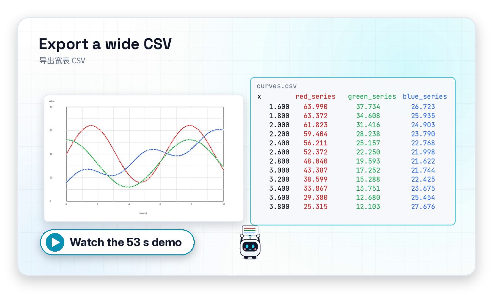
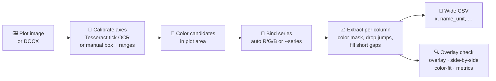

<a id="english"></a>

<div align="center">



<br>

**Got a colored plot, but no raw data? Get a CSV back from the plot itself, entirely on your own machine.**

[](https://github.com/AL-LIN-S/DataExtracker/releases/latest)
[](LICENSE)
[](pyproject.toml)
[-0891b2?labelColor=e2e8f0&logoColor=0f172a)](#-quick-start)
[](https://github.com/AL-LIN-S/DataExtracker/stargazers)

[**Download for Windows**](https://github.com/AL-LIN-S/DataExtracker/releases/latest) ·
[Quick start](#-quick-start) ·
[How it works](#-how-it-works) ·
[FAQ](#-faq) ·
[**中文说明**](README.zh-CN.md)

</div>

---

## 🎬 Demo

<div align="center">

[](https://github.com/AL-LIN-S/DataExtracker/releases/download/v0.2.0/DataExtracker-motion.mp4)

▶ [Watch the 53 s 1080p video with voiceover (MP4)](https://github.com/AL-LIN-S/DataExtracker/releases/download/v0.2.0/DataExtracker-motion.mp4)

</div>

## 😩 Why

You want to compare against a curve from a paper or report, but all you have is **the image**.
Clicking points one by one in a web digitizer works once. By the fifth plot of the week, it's no longer a workflow.

But many engineering plots already **draw each curve in its own bright color**.
Curve Extractor uses that: it separates the traces by color, maps pixels to axis values, and writes a wide CSV. Then it lets you **overlay the result on the original** so you can see whether to trust it.

## ✨ Features

| | Feature | What it actually does |
|:-:|---|---|
| 🎨 | **Color-based extraction** | Finds saturated color candidates in the plot area and extracts each trace by RGB + tolerance. No click-tracing. |
| 🔢 | **Axis OCR (tick labels only)** | Tesseract reads the axis **tick numbers** to calibrate automatically. It does not "AI-read" the curve. |
| ✋ | **Manual fallback** | OCR missed? Pick the plot's top-left / bottom-right in the GUI and type the X/Y ranges. |
| 📐 | **Multiple Y axes** | Bind each series to `left_1`, `right_1`, … with its own min/max. |
| 🤖 | **Auto-binding** | Heuristically binds red / green / blue candidates to series; override with `--series` or in the GUI. |
| 🚫 | **Exclusion regions** | Box out legends, labels or annotations before extracting (GUI). |
| 📄 | **Wide CSV** | `x` plus one column per series (`name_unit`); blanks where a trace is missing. Opens in Excel or pandas. |
| 🔍 | **Overlay check** | GUI preview on the original. DOCX batch also writes `_overlay`, `_side_by_side`, `_color_fit` images and `_metrics.csv`. |
| 📚 | **DOCX batch** | Processes reports laid out as `Pic n:` / `Statement n:`; skips table-like images and checks results against statement text. |
| 🔒 | **Local & offline** | A desktop tool, not a web app. Your plots never leave your machine. MIT licensed. |

## 🚀 Quick start

### Option A: Windows app (no Python needed)

1. Download **`CurveExtractor-0.2.0-windows-x64.zip`** from the [latest release](https://github.com/AL-LIN-S/DataExtracker/releases/latest).
2. Unzip it and keep the `_internal` folder next to `CurveExtractor.exe`, then double-click the exe.
3. *(Optional, for automatic axis reading)* install [Tesseract for Windows](https://github.com/UB-Mannheim/tesseract/wiki) and add it to `PATH`, or set:

   ```powershell
   $env:TESSERACT_CMD = "C:\Program Files\Tesseract-OCR\tesseract.exe"
   ```

   Tesseract is **not bundled**. Without it, you can still box the plot, type the ranges, extract and export.

### Option B: from source (Python 3.10+)

```bash
git clone https://github.com/AL-LIN-S/DataExtracker.git
cd DataExtracker
python -m venv .venv
source .venv/bin/activate          # Windows PowerShell: .\.venv\Scripts\Activate.ps1
python -m pip install -U pip
python -m pip install -e .
```

| OS | Tesseract (for axis OCR) |
|---|---|
| Windows | [UB Mannheim installer](https://github.com/UB-Mannheim/tesseract/wiki) + `PATH` or `TESSERACT_CMD` |
| macOS | `brew install tesseract` |
| Linux | `sudo apt install tesseract-ocr` |

**GUI**

```bash
python -m curve_extractor        # or: curve-extractor
```

**CLI** (installed entry point: `curve-extractor-cli`)

```bash
python -m curve_extractor.cli examples/sample_rgb_plot.png --output extracted.csv
```

## 🧪 Usage examples

```bash
# 1) Single image: auto axis OCR + auto color binding -> one CSV
python -m curve_extractor.cli examples/sample_rgb_plot.png --output extracted.csv

# 2) Bind series yourself when auto-binding picks the wrong colors
#    format: NAME:UNIT:R,G,B:TOLERANCE:Y_AXIS   (repeat --series per curve)
python -m curve_extractor.cli path/to/plot.png --output extracted.csv \
  --series "frequency:Hz:235,0,0:45:left_1" \
  --series "power:MW:0,235,0:45:right_1"

# 3) Print more color candidates (default 6)
python -m curve_extractor.cli path/to/plot.png --max-colors 10

# 4) DOCX batch: every "Pic n" plot -> CSV + overlay/side-by-side/color-fit/metrics
python -m curve_extractor.cli report.docx --output-dir outputs
```

The single-image CLI prints the detected plot area, X range, Y axes, color candidates and bindings, then writes **only the CSV you asked for**.
DOCX batch mode writes `pic_NNN.csv` plus review images per picture, and `batch_summary.csv` / `batch_summary.txt`. It exits with code `2` if any picture failed.

<details>
<summary><b>Expected DOCX layout</b></summary>

```text
Pic 1:
[plot image]
Statement 1:
[optional text used for validation]

Pic 2:
[plot image]
[optional table image]
Statement 2:
[optional text]
```

Table-like images are treated as statement / validation input, not as plots.
</details>

## 🧠 How it works



## 🎯 Accuracy & the overlay check

| Original plot | Extracted curves overlaid | Side by side |
|:-:|:-:|:-:|
|  |  |  |

Pixel quantization, axis calibration and color binding all add error, so **results are not 100% accurate**.
Use the overlay: if the extracted line sits on the original trace, use the numbers. If it doesn't, fix the plot box, ranges or colors and export again.
In DOCX batch mode, `_metrics.csv` reports per series `source_coverage_fraction`, `path_on_source_fraction` and `missing_fraction` so you can spot bad extractions without opening every image.

**Works best:** white background · saturated colored lines · linear axes.
**Will struggle:** log axes (not supported) · dark backgrounds · grayscale scans · same-color tangled curves.

## ❓ FAQ

<details><summary><b>Is this a web app? Are my images uploaded?</b></summary>
No. It's a local desktop / command-line tool. Nothing is uploaded.
</details>

<details><summary><b>Do I need Tesseract?</b></summary>
Only for <b>automatic</b> axis calibration (it reads tick numbers). In the GUI you can always pick the plot corners and type the ranges by hand. The single-image CLI relies on OCR, so it needs Tesseract.
</details>

<details><summary><b>Does it support log axes or grayscale plots?</b></summary>
Not currently. Axes are linear, and series are separated by color.
</details>

<details><summary><b>The colors were bound to the wrong series.</b></summary>
Auto-binding is heuristic. Use <code>--series NAME:UNIT:R,G,B:TOLERANCE:Y_AXIS</code> on the CLI, or add/edit series in the GUI's color table, then re-check the overlay.
</details>

<details><summary><b>What language is the GUI in?</b></summary>
The GUI labels are currently in Chinese (导入图片, 自动识别坐标轴, 识别候选颜色, 提取并预览, 导出 CSV …). The flow follows the same five steps described above.
</details>

<details><summary><b>Windows says Tesseract was not found.</b></summary>
Add <code>tesseract.exe</code> to <code>PATH</code> or set <code>TESSERACT_CMD</code> to its full path, then restart the app or terminal.
<br>
</details>

## 🗺️ Roadmap

Ideas, none of them promised yet. Feedback and PRs are welcome:

- [x] Windows one-folder GUI build (v0.2.0 release)
- [ ] Merge the v0.2 Windows build branch into `main`
- [ ] Log-scale axes
- [ ] Better handling of dark backgrounds and grayscale / line-style series
- [ ] English GUI labels
- [ ] Publish to PyPI

## 🤝 Contributing

Issues and pull requests are welcome. Please include a **synthetic or shareable** plot if you report an extraction problem, and don't post confidential project figures.

```bash
python -m pip install -e ".[dev]"
python -m pytest -q
```

## 📜 License

[MIT](LICENSE) © Curve Extractor contributors

## ⭐ Star history

<a href="https://star-history.com/#AL-LIN-S/DataExtracker&Date">
  
</a>

---

<a id="中文"></a>

## 🇨🇳 中文速览

**没有原始数据，只有一张图？** Curve Extractor 在你自己的电脑上，把彩色曲线图按颜色拆开、按坐标轴换算，导出宽表 CSV，再把结果叠回原图让你核对。

- **Windows：** 到 [Releases](https://github.com/AL-LIN-S/DataExtracker/releases/latest) 下载 `CurveExtractor-0.2.0-windows-x64.zip`，解压后双击 `CurveExtractor.exe`（`_internal` 文件夹要和 exe 放在一起）。
- **源码：** `python -m pip install -e .`，然后 GUI 用 `python -m curve_extractor`，命令行用 `python -m curve_extractor.cli 图.png --output extracted.csv`。
- **Tesseract 只用来读坐标轴刻度数字**，不是"AI 识曲线"，需要另外安装。没装也可以在 GUI 里手动框图区、填范围。
- **适用：** 白底、彩色曲线、线性坐标。对数轴、深色底、灰度图暂不支持。**结果不是 100% 准确，用之前一定要看叠图。**

完整中文教程（GUI 逐步说明、输出文件、测试）：[README.zh-CN.md](README.zh-CN.md)
