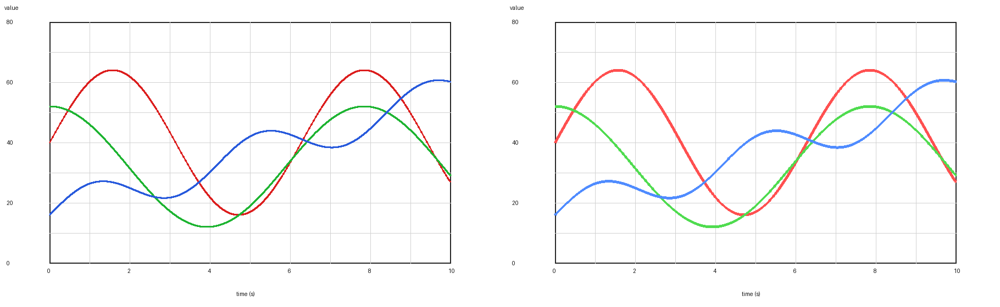

# 工程曲线图数字化工具（CLI + 桌面 GUI）

[English](README.md) | [中文](README.zh-CN.md)

**把彩色工程曲线图提取成 CSV** — 支持命令行和 PySide6 桌面端，并自动生成叠图复核。

适合白底、红/绿/蓝饱和色曲线、黑灰网格、线性坐标的工程图。DOCX 里的说明文字或表格图也可作为校验提示。



## 和常见描点工具比，多了什么

- **彩色多曲线**自动候选与绑定  
- **多 Y 轴**支持（自动或手动）  
- **DOCX 批量**（`Pic n` / `Statement n`）  
- 每次导出都带 **overlay / 并排重绘 / 色拟合检查**，方便人工核对  

## 30 秒快速试

需要 Python 3.10+。在仓库根目录：

```bash
python -m venv .venv
source .venv/bin/activate   # Windows PowerShell: .\.venv\Scripts\Activate.ps1
python -m pip install -U pip
python -m pip install -e .
python -m curve_extractor.cli examples/sample_rgb_plot.png --output extracted.csv
```

**打开 GUI：**

```bash
python -m curve_extractor
```

### 安装 Tesseract（自动识别坐标轴）

需要单独安装 Tesseract，并保证在 `PATH` 里，或设置环境变量 `TESSERACT_CMD`。

| 系统 | 常见装法 |
|---|---|
| Windows | [安装包](https://github.com/UB-Mannheim/tesseract/wiki)，然后 `$env:TESSERACT_CMD = "C:\Program Files\Tesseract-OCR\tesseract.exe"` |
| macOS | `brew install tesseract` |
| Linux | `sudo apt install tesseract-ocr` |

## 截图

| 原图 | 叠图预览 |
|---|---|
|  |  |

更多说明见 [`examples/`](examples/)。

## 常用命令

单图：

```bash
python -m curve_extractor.cli 路径/图.png --output extracted.csv
```

手动指定曲线绑定：

```bash
python -m curve_extractor.cli 路径/图.png \
  --output extracted.csv \
  --series "power:MW:0,235,0:45:right_1"
```

DOCX 批量：

```bash
python -m curve_extractor.cli 路径/summary.docx --output-dir outputs
```

安装后也可使用入口：`curve-extractor`（GUI）、`curve-extractor-cli`（CLI）。

## 隐私与限制

仓库不含私有报告图、DOCX、本地 OCR 或依赖镜像。仅支持线性坐标；OCR 效果依赖清晰度；自动红绿蓝绑定是启发式的，请务必看复核图。

## 许可证

MIT
