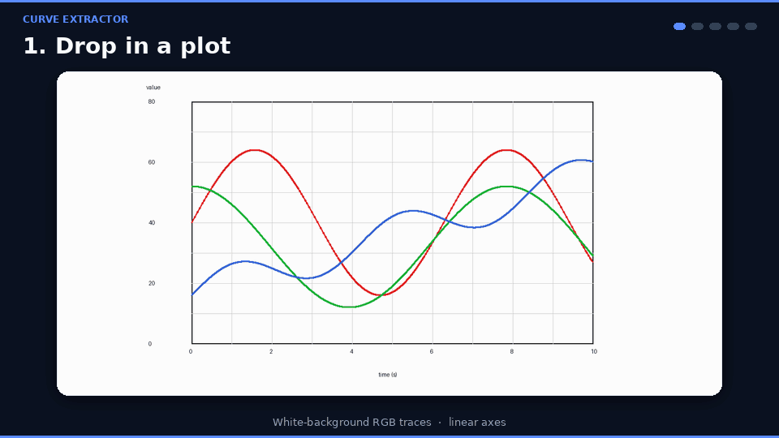
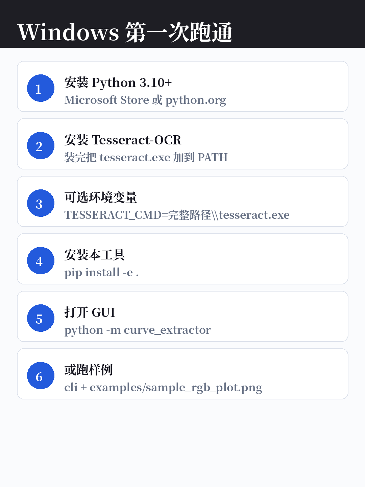
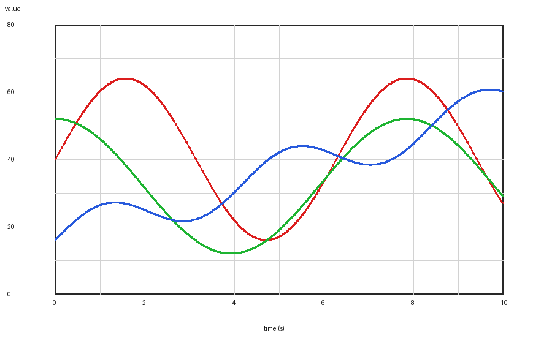
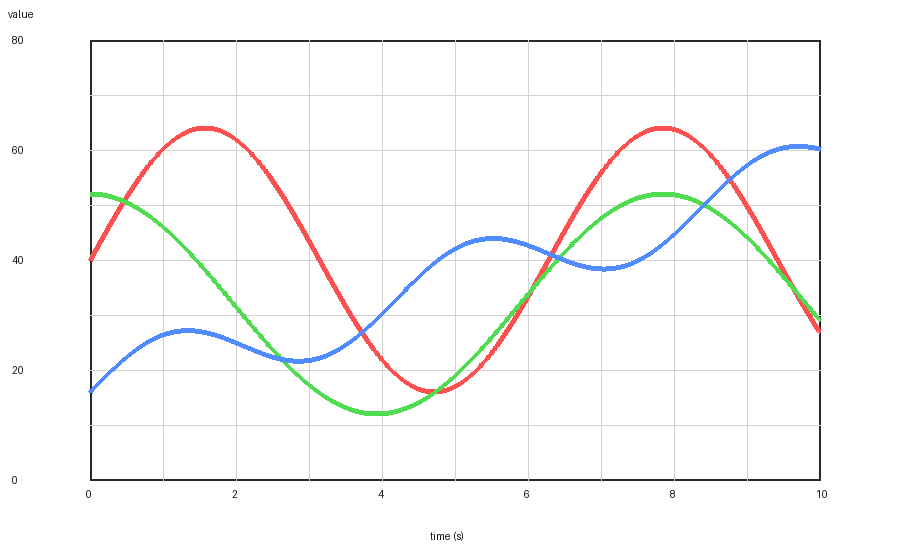

# Curve Extractor

[English](README.md) | [中文](README.zh-CN.md)

图在扫描件里，数不在。一周第五次对着网页描点，那不叫工作流。

**Curve Extractor** 把彩色工程曲线图提取成宽表 CSV——本地跑，命令行或 PySide6 桌面都行。每次提取都写出叠图，对得上对不上，一眼能看出来。



## 为什么做这个

试验报告里的曲线经常只是图。你要的是数列，不是又一张截图。通用描点工具适合一条线、做一次。这个工具冲着那堆图去的：白底红/绿/蓝曲线、黑灰网格、线性坐标、多 Y 轴，以及 `Pic n` / `Statement n` 排版的 DOCX。

- **彩色多曲线**自动候选与绑定
- **多 Y 轴**（自动或手动）
- **DOCX 批量**（`Pic n` / `Statement n`）
- 每次导出都带 **overlay / 并排重绘 / 色拟合检查**，方便人工核对

DOCX 里的说明文字或表格图也可作为校验提示。

## 先跑通一次

需要 Python 3.10+。在仓库根目录：

```bash
python -m venv .venv
source .venv/bin/activate   # Windows PowerShell: .\.venv\Scripts\Activate.ps1
python -m pip install -U pip
python -m pip install -e .
python -m curve_extractor.cli examples/sample_rgb_plot.png --output extracted.csv
```

会得到一张宽表 CSV（`x`，后面每一列一条曲线）。DOCX 批量模式传入 `.docx` 和 `--output-dir`。

**打开 GUI：**

```bash
python -m curve_extractor
# 或：curve-extractor
```

安装后命令行入口是 `curve-extractor-cli`。

### 安装 Tesseract（自动识别坐标轴）

需要单独安装 Tesseract，并保证在 `PATH` 里，或设置环境变量 `TESSERACT_CMD`。

| 系统 | 常见装法 |
|---|---|
| Windows | [安装包](https://github.com/UB-Mannheim/tesseract/wiki)，然后 `$env:TESSERACT_CMD = "C:\Program Files\Tesseract-OCR\tesseract.exe"` |
| macOS | `brew install tesseract` |
| Linux | `sudo apt install tesseract-ocr` |

## Windows 第一次跑通

自动识别坐标轴失败，多半是 Tesseract 没装好。按这个最短路径来：



1. 安装 Python 3.10+
2. 安装 [Windows 版 Tesseract](https://github.com/UB-Mannheim/tesseract/wiki)，把 `tesseract.exe` 加进 `PATH`，或设置：

```powershell
$env:TESSERACT_CMD = "C:\Program Files\Tesseract-OCR\tesseract.exe"
```

3. `python -m pip install -e .`
4. 打开 GUI：`python -m curve_extractor`。OCR 不准时，可手动框选图区、改坐标范围，照样能提取。
5. 或跑样例：`python -m curve_extractor.cli examples/sample_rgb_plot.png --output extracted.csv`

## 截图

| 原图 | 叠图预览 |
|---|---|
|  |  |

样例图在 [`examples/`](examples/)（合成数据，不含私有报告）。

## 功能

- OCR 检测图区和坐标刻度
- 在图区内找饱和彩色曲线候选
- 每个 x 像素列取一个值，导出宽表 CSV
- 多 Y 轴，自动绑定红 / 绿 / 蓝系列
- 复核产物：叠图、并排重绘、色拟合图、分系列指标
- DOCX 批量：`Pic n` + `Statement n`；表格类图片当作说明/校验输入
- PySide6 桌面 GUI，可手动标定和复核

## 常用命令

安装后入口：`curve-extractor`（GUI）、`curve-extractor-cli`（CLI）。
模块形式：`python -m curve_extractor.cli`

单图：

```bash
python -m curve_extractor.cli 路径/图.png --output extracted.csv
```

自动绑定不对时，手动指定曲线：

```bash
python -m curve_extractor.cli 路径/图.png \
  --output extracted.csv \
  --series "power:MW:0,235,0:45:right_1"
```

`--series` 格式：`NAME:UNIT:R,G,B:TOLERANCE:Y_AXIS`

DOCX 批量：

```bash
python -m curve_extractor.cli 路径/summary.docx --output-dir outputs
```

DOCX 预期结构：

```text
Pic 1:
[曲线图]
Statement 1:
[可选校验文字]

Pic 2:
[曲线图]
[可选表格图]
Statement 2:
[可选校验文字]
```

## GUI 流程

1. 打开图片
2. 自动识别坐标轴，或手动框选图区
3. 核对或修改 x/y 轴范围
4. 检测曲线颜色
5. 把系列绑到 Y 轴
6. 提取并预览叠图
7. 需要时加排除矩形
8. 导出 CSV

## 输出文件

单图模式写出指定的 CSV。

DOCX 批量会在输出目录写下：

- `pic_001.csv`、`pic_001_overlay.png`、`pic_001_side_by_side.png`、`pic_001_color_fit.png`、`pic_001_metrics.csv`
- `batch_summary.csv` / `batch_summary.txt`

CSV 是宽表（`x,frequency_Hz,power_MW,...`）；缺测留空。

## 测试

```bash
python -m pip install -e ".[dev]"
python -m pytest -q
python -m compileall curve_extractor tests
```

## 项目结构

```text
curve_extractor/
  app/       PySide6 GUI
  core/      标定、OCR、颜色检测、提取、DOCX 批量
  cli.py     命令行入口
examples/    样例图（合成）
docs/images/ README 配图
tests/
```

包名（`pyproject.toml`）：`curve-extractor`。入口：`curve-extractor`（GUI）、`curve-extractor-cli`（CLI）。

## 隐私与限制

仓库不含私有报告图、DOCX、提取结果、本地 OCR 或依赖镜像。仅支持线性坐标；OCR 效果依赖清晰度和 Tesseract 模型；自动红绿蓝绑定是启发式的，请务必看复核图。

## 许可证

MIT
